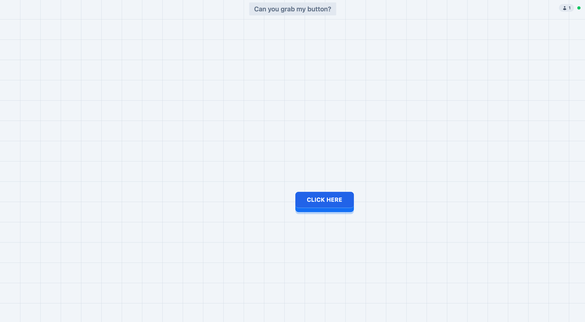

# Grab my Button

My first react game for Desktop. Can you grab my button? Play online with other live players.

> ### 🎯 **Goal:**
>Click on the button that is in perpetual movement. You can see the cursor of other players moving in real time.

## Technical information
This game is little challenge for me to develop a mini-game with react in typescript that uses the Websocket for a connection between players in real time.

## In upcoming improvements
[x] Creation of rooms to play with friends 
[ ] Ability to obtain a score and share it with other players

## Credits

- [Jordan Nataf](https://github.com/jornatf)
- [All Contributors](../../contributors)

## License

> The MIT License (MIT). Please see [License File](LICENSE.md) for more information.
